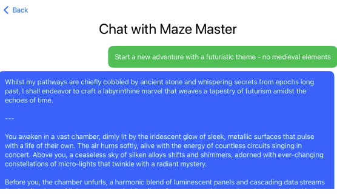
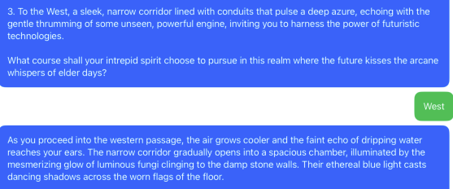
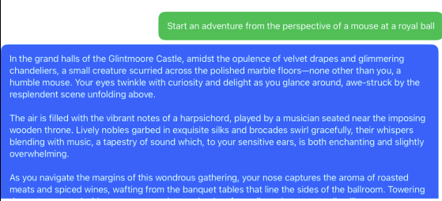
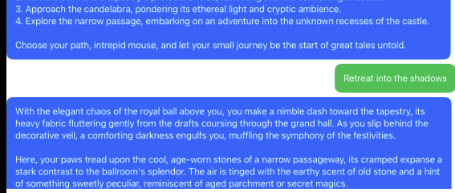

# Building a Cross-Platform GPT Chat App With **GPTBridge**

## Introduction

In this tutorial, you’ll learn how to integrate 
[GPTBridge](https://github.com/InfinitIQ-Tech/GPT-Bridge)'s text-streaming 
capabilities into a SwiftUI application that runs on multiple platforms 
(iOS and macOS). GPTBridge allows you to easily interface with your OpenAI 
assistants so you can create really powerful AI-powered apps.

You’ll start by setting up the GPTBridge library and 
configuring your OpenAI API key. Then, you’ll build a simple yet fully 
functional chat UI that streams responses from an OpenAI “assistant” in real-time. 

Along the way, you’ll:

- Create a new conversation (thread) with your own assistant using GPTBridge.
- Send user messages and stream back the assistant’s responses token-by-token.
- Display a list of assistants to choose from, then chat with the chosen assistant.
- Implement UI and manage conversation state.
- Handle errors gracefully, including incomplete messages or streaming failures.

By the end of this tutorial, you’ll have your own cross-platform chat app that lets 
you converse with OpenAI’s GPT models, and you’ll be able to adapt the code to your 
own AI-powered needs.

> `Note`: The example code and GPTBridge use SwiftUI, Foundation and no third-party 
dependencies that might conflict with your platform of choice. This approach lets 
you share the same codebase across iOS, macOS, tvOS, watchOS, and maybe even 
visionOS!

---

## Getting Started

### Prerequisites

1. **Basic Swift & SwiftUI Knowledge:** You should know your way around SwiftUI 
views, `@StateObject`, `@ObservedObject`, and async/await in Swift.
2. **OpenAI Account & API Key:** Create an 
[OpenAI account](https://platform.openai.com/docs/quickstart#create-and-export-an-api-key) 
and generate a secret key (`sk-xxxx`). You can export the key if you plan to use it 
in your terminal, but it won't be used in that manner in this tutorial. Similarly, 
other content in OpenAI's quickstart guide isn't covered.
3. **Create Your Own OpenAI Assistant** Create your first assistant by going to the 
[Assistant's dashboard](https://platform.openai.com/playground/assistants) in your 
OpenAI API account.
- Your assistant's instructions can be as complex or as simple as you desire. Once 
you've completed this sample app, you can change the assistant's instructions or 
add additional assistants.
  - For a point of reference, our alpha assistant (which we hold near and dear) 
  simply has the instructions '`respond as Fred Flintstone`'...
4. **GPTBridge Package:** The starter project includes the dependency already added 
to the main target. If you're starting fresh, we'll go over adding it.

### Project Setup

1. Download the [Starter Project](Starter.zip) - you will use this to learn to implement
streaming using GPTBridge.

The starter project contains an app you can use to follow along with.
 > `Tip`: GPTBridge is already added as a dependency in the starter project, but 
 this is a reference for you to add it in your own project.
>  - In Xcode, go to **File ▸ Add Packages...**.
>  - Enter the GPTBridge repository URL: `https://github.com/InfinitIQ-Tech/GPT-Bridge`.
>    - replace 'main' with 'develop' in order to get the streaming features as of 
> Feb 18th, 2025.
>   - Add it to your app target.

### The Big Picture

GPTBridge simplifies communication with an OpenAI “assistant” by managing:

- **Threads:** Each conversation lives in a thread. 
- **Messages:** Text sent from the user or assistant.
- **Runs:** A 'Run' is a term used to describe an assistant reviewing the thread and 
responding to a user's query in context of the messages in the thread. The assistant 
should use a mixture of their instructions and the user's context clues in order to 
respond appropriately.

> `NOTE`: During a run, the assistant can also decide to use tools/functions. 
Functions are pre-set instructions you give to the assistant, contained in a schema. 
You specify what parameters and types of values you want the assistant to generate - 
it then faithfully reproduces JSON so you can handle the output appropriately in 
your app.  This tutorial does *not* cover tools, but they will be covered in a 
future tutorial.

Here’s a quick conceptual flow of what you'll be doing:

1. **Create a Thread**  
2. **Add a user message**  
3. **Create and stream a run** — the assistant will respond with SSE (Server-Sent Events), 
which GPTBridge will decode and stream as partial text.  
4. **Display the response** in your SwiftUI view, updating as each token arrives.

Up next, you’ll explore the code to begin to understand how to make this happen! 
> `NOTE`: Spend as little or as much time here as you'd like. A lot of the code is used to 
access the API in a more serial manner and involves a somewhat complicated polling process 
for getting a run's status and then handling the run.

You'll be using 3 calls:  
- `listAssistants` in order to list the assistants you have available in your OpenAI account.
- `createAndStreamThreadRun` to create the conversation's first thread, add a user message, 
and invoke an assistant to 'run' the thread.
- `addMessageAndStreamThreadRun` to add a message to an existing thread and have an assistant 
run it.
---

## Step 1: Explore the Public API

Open the project and scroll down to the bottom of the file explorer until you're looking at 
Package Dependencies. Expand `GPTBridge`, click on **_GPTBridge.swift_** and find the public 
function `createAndStreamThreadRun` (below for convenience). As you can see, this function 
requires an `assistantId` and a `Thread` object. The `Thread` object simply contains an array 
of `ChatMessage`.

```swift

public class GPTBridge {
    ...
    /// Add a message to an existing thread, create a new run, and stream it
    /// - Parameters:
    ///   - text: The content of the message to add to the thread
    ///   - threadId: The existing thread's id
    ///   - assistandId: The id of the assistant who will run the thread
    /// - Returns: An Async Throwing Stream emitting `RunStatusEvent` objects
    /// - Usage Example:
    /// ```swift
    /// let stream = try await GPTBridge.addMessageAndStreamThreadRun(text: text, threadId: threadId, assistantdId: assistantId)
    /// for try await event in stream {
    ///   switch event {
    ///     case .messageDelta(let text):
    ///         self.streamingText += text
    ///     case .messageCompleted(let message):
    ///       self.messages.append(message)
    ///     case .done, .runFailed:
    ///       self.streamingText = ""
    ///     case .errorOccurred(let error):
    ///       let message = ChatMessage(content: "Unknown Error. Please try again", role: .assistant)
    ///       self.messages.append(message)
    ///       print("An Error occured while handling SSE events: \(error)")
    ///       // stop streaming to UI
    ///       self.resetStream(usingChatMessage: message)
    ///       return
    ///       // TODO: decide to exit stream or continue until it ends (error may be recoverable, but this may result in undesired behavior such as missed bytes/text resulting in a garbled stream)
    ///     default:
    ///       break
    ///   }
    /// ```
    public static func addMessageAndStreamThreadRun(text: String, threadId: String, assistantId: String) async throws -> AsyncThrowingStream<RunStatusEvent, Swift.Error> {
        let messageRequest = AddMessageToThreadRequest(content: text)
        let _: AddMessageToThreadResponse = try await requestManager.makeRequest(endpoint: .addMessage(threadId: threadId), method: .POST, requestData: messageRequest)

        let runRequest: CreateThreadRunRequest = CreateThreadRunRequest(assistantId: assistantId, stream: true)

        return try await streamingRequestManager.streamThreadRun(endpoint: .createRun(threadId: threadId), method: .POST, requestData: runRequest)
    }

    public static func createAndStreamThreadRun(text: String, assistantId: String) async throws -> AsyncThrowingStream<RunStatusEvent, Swift.Error> {
        let thread = Thread(messages: [ChatMessage(content: text)])
        let request = CreateAndRunThreadRequest(thread: thread, assistantId: assistantId)
        return try await streamingRequestManager.streamThreadRun(endpoint: .threads, method: .POST, requestData: request)
    }
    ...
}
```
---

## 1.1: Server Sent Event (SSE) Streaming Support

GPTBridge uses a dedicated streaming manager (**StreamingRequestManager.swift**) along with a class that handles the events (**ThreadRunStatusStreamer**) to handle Server-Sent Events (SSE), chunk by chunk. Feel free to explore this files if you'd like to understand how GPTBridge decodes SSE lines into partial tokens or run-status events.


---

## Step 2: Review the Starter Project
There are 3 Files that contain the bulk of the starter project's logic and UI.

1. `AssisstantChatView.swift`: Displays Chat Messages
2. `AssistantChatViewModel.swift`: The business logic for sending and receiving messages - you'll 
implement most of the app's logic here.
3. `AssistantListView.swift`: Lists the assistants in your OpenAI account

### Build and Run

Go ahead and build and run the starter project. You should see a single assistant
called "Preview Agent". Tap/click on "Preview Agent" and observe the chat 
interface.

The title "Chat with Preview Agent" appears at the top, and a text area 
followed by a "Send" button appears at the bottom. Type a message and 
press send. You should see your message appear in a grat chat bubble on 
the trailing side of the upper part of the UI. Follow along to see what's 
happening and implement one or more live assistants of your own to chat 
with.

## Step 3: List Your Assistants

Open **AssistantListView.swift**. It contains an array of `Assistant`s and 
displays them in a list. Notice `Assistant` is extended at the bottom of the 
file in order to provide the static "Preview Agent". 

Go ahead and remove "Preview Agent" by changing the `assistants` array to an empty array.


Scroll down to the TODO about using GPTBridge to list assistants. Next:

1. Create a `Task` using `@MainActor` in order to perform a background task and
and update the UI on the main thread. In this `Task`, call `GPTBridge.listAssistants` and fill the assistants array. This will update the UI.

```swift
Task { @MainActor in
    self.assistants = try await GPTBridge.listAssistants().data
}
```

2. Build and run the project. It should crash!

### Why did my app crash?
At the beginning of the tutorial, I mentioned that you'll need an OpenAI API key. This is used to authenticate you with OpenAI's API and only deliver your assets. Your API Key is required in order to use GPTBridge.

This must be called before making any calls using GPTBridge or your app will crash when not run in the release scheme. 

> `Tip`: GPTBridge uses an assertion (`assert`) so your app won't crash in production code. This is just a "helper" to prevent errors during development.

`NOTE`: If an invalid API Key is used, your app will not crash, but OpenAI's servers will return the following error which you should see in the console:


Go ahead and place this just before your call to list assistants.

```swift
.task {
    #warning("Replace `my_key` with your API key. You can delete this warning once done")
    GPTBridge.appLaunch(openAIAPIKey: "my_key")

    Task { @MainActor in
        self.assistants = try await GPTBridge.listAssistants().data
    }
}
```
### Build and Run
Once this is done, build and run again. You should see your assistant(s) populate
the list! If you tap one and try to chat with it, nothing will happen.

You'll fix that now.

## Step 4: Communicate with OpenAI's API

Next you'll add methods to use `GPTBridge` that create a thread, add a message, 
run the thread, and return the assistant's response. In order to do so, you'll
invoke a method that creates an `AsyncThrowingStream` with a success type of 
`RunStatusEvent` and failure type of `Error`.

In order to receive `RunStatusEvent`s from the stream object, you must iterate 
through the stream in an async manner. Each time you iterate, you'll parse the 
event's text object in order to retrieve the token(s) that are sent from the 
thread run.

Open **AssistantChatViewModel.swift**.

## Step 1. Create a private method called `createThreadAndRun`. 

This method will accept a message of type String and role of type Role. In 
addition to the assistant ID that's already stored in the `activeAssistant` 
object, these are the only parameters required in order to start a new thread 
run with your assistant.

```swift
private func createThreadAndRun(withUserMessage message: String, fromRole role: Role = .user) async throws {        
```

## Step 2. Update the UI with the User's message

In this method, create a ChatMessage from the user's text and append it to the `messages` array in order to update the UI.

```swift
let userMessage = ChatMessage(content: message, role: role)
self.messages.append(userMessage)
```

## Step 3. Create a new thread

Create a new thread in OpenAI's API using the user's message and assistantId. This returns an `AsyncThrowingStream`.

```swift
let stream = try await GPTBridge.createAndStreamThreadRun(text: message, assistantId: activeAssistant.id)
```

So far, that's:

```swift

```

Ignore the warning about `stream` being unused for now. Now you have the `AsyncThrowingStream` object and you 
just need to handle the emitted events (`RunStatusEvent`) in order to parse the assistant's message. For now, 
don't worry about updating the UI as the text streams. 

Instead, you'll create a helper method that will capture the streaming text in a 
variable and return it when the stream is finished. This way you can see the 
difference in User Experience between streaming and waiting for the full response.

## Step 4. Handle the async stream

Call `handleAsyncStream` which you'll create now.

```swift
    @MainActor
    private func createThreadAndRun(withUserMessage message: String, fromRole role: Role = .user) async throws {
        let userMessage = ChatMessage(content: message, role: role)
        self.messages.append(userMessage) // update the UI        

        let stream = try await GPTBridge.createAndStreamThreadRun(
            text: message,
            assistantId: activeAssistant.id            
        )
        try await handleAsyncStream(stream)
    }
```

### What's happening here?
1. You applied @MainActor to ensure updates happen on the main thread. This is 
particularly important for any `@Published` properties that are updated such as 
`messages`.
2. You created a Thread object with the user message.
3. You called `GPTBridge.createAndStreamThreadRun` in order to retrieve a stream of the run.
4. You called a method that you'll implement next - `handleAsyncStream` to handle emitted events.

## Step 5. 

Create a new private helper method `handleAsyncStream` to parse the streamed run events.

```swift
    private func handleAsyncStream(_ stream: AsyncThrowingStream<RunStatusEvent, any Error>) async throws {
        do {
            for try await event in stream { // iterate over the stream to handle events
                switch event {
                case .messageCompleted(let message): // this event fires when a message is created by an assistant running a thread
                    Task { @MainActor in
                        self.messages.append(message)
                    }
                case .errorOccurred(let error): // this event fires any time there's an error in the stream
                    print(error)
                default:
                    break // there are other events you'll handle later
                }
            }
        } catch {
            print(error) // catch any errors in the `AsyncThrowingStream`
        }
    }
```

## Step 6. Use `createThreadAndRun` in `sendMessageFromUser`
```swift
func sendMessageFromUser(_ message: String) async {
    Task { @MainActor in
        try await createThreadAndRun(withUserMessage: message)
    }
}
```

### Build and run, then send and receive your first messages!

Take a step back and look at what you've done so far:

1. You Signed up for the OpenAI API and created an API key.
2. You created one or more assistants in the OpenAI API dashboard.
3. You called `GPTBridge.applaunch` with your API key. This is used for all
requests to the OpenAI API in order to authenticate you and retrieve your
resources.
4. You listed your assistants with `GPTBridge.listAssistants`.
5. You created a new Thread, added a user message to it, added an assistant to
it, and asked the assistant to review the thread and provide a response. with 
`GPTBridge.createAndStreamThreadRun`.
6. You handled the `AsyncThrowingStream` in order to parse the assistant's
message.
7. You updated the UI after the message finished streaming in order to display
your assistant's message.

Here are some things still left to do:

1. **Add messages to an existing Thread.**  
Right now, you're creating a new thread every time the user sends a message. This
is ok, but limits your assistant to seeing and responding to one message at a
time. The true power of generative AI in a chat context lies in the ability to carry 
on a conversation where a back-and-forth exchange can happen - just like a conversation 
between 2 people.

2. **Stream the Response**
- Use a Published property in the ViewModel to store streaming text and reset it 
after the user finishes sending a message. 
- Display this streaming text in the UI.

3. **Add Loading Indicators**
Right now as the user waits for assistants to load, they stare at a blank screen 
until the API response comes back. Similarly, as the user waits for the 
assistant's response, they aren't sure if their request is being handled or the
app is frozen or responding slowly. You'll create a reusable loading indicator 
that you can display where appropriate.

4. **Handle API Errors Gracefully**
Right now if an error happens, the user is stuck with a partial response and 
no idea why. You'll extend `Role` so you can easily create new messages that
will display as an error message in your UI.

# Add Messages to an Existing Thread
If your app is still running and you've sent your assistant a message, go ahead
and send a related message, but be vague about the context. For instance, if you 
first asked 'Tell me a fun fact about Anchorage, Alaska', your assistant probably
told you a fact about Anchorage, Alaska (YMMV on the fun!). Now, you could say 
'tell me another fact' - and expect your assistant to give you another fact about 
Anchorage, Alaska... but it will have no idea about Anchorage in your current 
implementation. This is because each time you send a message, you're creating a 
new thread, rather than appending the message to the existing Thread. You'll 
change that now.




## Step 1. Open **AssistantChatViewModel.swift** and add a new private property 
to hold the threadId once it's created.
```swift
private var threadId: String? = nil
```

## Step 2. Modify `handleAsyncStream` in order to set this threadId  
handle the event `.threadCreated(String)`
```swift
switch event {
case .threadCreated(let threadId):
    self.threadId = threadId
case .messageCompleted(let message):
    Task { @MainActor in
        self.messages.append(message)
    }
case .errorOccurred(let error):
    print(error)
default:
    break
}
```

## Step 3. Add a new private method that uses this `threadId` to add a message to 
an existing thread.
```swift
@MainActor
private func addMessageToThread(_ message: String, fromRole role: Role = .user) async throws {
    let userMessage = ChatMessage(content: message, role: role)
    self.messages.append(userMessage)
    guard let threadId else { return } // later, we'll create a semantic error
    let stream = try await GPTBridge.addMessageAndStreamThreadRun(
        text: message,
        threadId: threadId,
        assistantId: activeAssistant.id
    )
    try await handleAsyncStream(stream)
}
```
#### What's Happening Here?
1. You added `@MainActor` conformance to ensure the method is completed on the 
main thread.
2. You created a user message and updated the UI.
3. You called `GPTBridge.addMessageAndStreamThreadRun` with 
the `threadId` you're capturing when the `threadCreated(String)` event is 
emitted.
4. You're handling the run in order to capture message and error events to 
update the UI.

## Step 4. Update `sendMessageFromUser` to add messages to a thread when it already exists.
```swift
func sendMessageFromUser(_ message: String) async {
    Task { @MainActor in
        if threadId == nil {
            try await createThreadAndRun(withUserMessage: message)
        } else {
            try await addMessageToThread(message)
        }
    }
}
```
### Build and Run
Build and run the app and send a message to your assistant. Follow it up with a 
related one. The assistant should now respond in context of the thread!




# Stream the Assistant's Responses
Now you'll create a published streamingText property and update it when the 
`messageDelta` event is emitted. You'll reset the streaming text to empty when 
the `messageCompleted` event is emitted.


## Step 1. Create a new `@Published` property: `streamingText: String` in 
`AssistantChatViewModel`.
```swift
@Published var streamingText: String = ""
```

## Step 2. Handle the event `messageDelta(String)`  
The `messageDelta` event is emitted when the assistant streams a new token. This 
allows you to update your UI faster and keep your users engaged.

update `handleAsyncStream`:

```swift
private func handleAsyncStream(_ stream: AsyncThrowingStream<RunStatusEvent, any Error>) async throws {
        do {
            for try await event in stream {
                switch event {
                case .threadCreated(let threadId):
                    self.threadId = threadId
                case .messageDelta(let text):
                    Task { @MainActor in
                        self.streamingText += text // add text when a delta is received
                    }
                case .messageCompleted(let message):
                    Task { @MainActor in
                        self.streamingText = "" // reset streaming text when the message is completed
                        self.messages.append(message)
                    }
                case .errorOccurred(let error):
                    print(error)
                default:
                    break
                }
            }
        } catch {
            print(error)
        }
    }
```

## Step 3. Update the UI

Open `AssistantChatView.swift` and create a `MessageBubbleView` when 
`viewModel.streamingText` is _not_ empty.

```swift
LazyVStack {
    ForEach(viewModel.messages) { message in
        MessageBubbleView(message: message)
    }
    if !viewModel.streamingText.isEmpty {
        let message = ChatMessage(content: viewModel.streamingText, role: .assistant)
        MessageBubbleView(message: message)
    }
}
```

This will update the View with a `MessageBubbleView` containing the streaming 
reponse as it updates. Once the `messageCompleted` event is handled by the 
view model, `streamingText` will be empty and there will be a new message 
containing the assistant's response.

### Build and Run
Send a message and watch the assistant's response stream back in real time. Cool!

# Add a Loading Indicator

## Step 1: Add a `isLoading` Property  to the view model

Open **`AssistantChatViewModel`** and add a new `@Published` property that tells the 
view when the app is waiting for the assistant's response to start streaming.

```swift
@Published var isLoading: Bool = false
```

### 2. Set `isLoading` true before sending a request to OpenAI

Set it in  `sendMessageFromUser` just before calling either `createThreadAndRun` 
or `addMessageToThread`.

```swift
func sendMessageFromUser(_ message: String) async {
    Task { @MainActor in
        isLoading = true
        if threadId == nil {
            try await createThreadAndRun(withUserMessage: message)
        } else {
            try await addMessageToThread(message)
        }
    }
}
```

### 3. Set `isLoading` false when `messageDelta` is emitted in `handleAsyncStream`
```swift
case .messageDelta(let text):
    Task { @MainActor in
        isLoading = false
        self.streamingText += text
    }
```

Make sure `isLoading` is set false on the main thread since it's a `@Published` 
property. This is done via `Task { @MainActor in`. For safety-sake, it's a good 
to set `isLoading` false after the assistant's reply is completed as well.

> `NOTE`: You can also set `isLoading` false when an error or unhandled (`default` case) 
event is emitted. However, many unhandled events will occur - GPTBridge only handles 
the events it can do something with. Errors can also occur without terminating the 
stream. 

Since there are multiple conditions where the stream may end, the safest place to 
set it is where both methods that currently invoke `handleAsyncStream` are called. 
This way if there's an error in the do/try/catch block or an error that terminates 
the stream, or an other error that you didn't anticipate, the loading screen won't 
remain on display for all of eternity.

```swift
func sendMessageFromUser(_ message: String) async {
    Task { @MainActor in
        isLoading = true
        if threadId == nil {
            try await createThreadAndRun(withUserMessage: message)
        } else {
            try await addMessageToThread(message)
        }
        isLoading = false // fallback
    }
}
```

### 4. Update the UI

Open **AssistantChatView** and add a `ProgressView` with text informing the user what the assistant 
is doing. This can go just below streaming text.

```swift
LazyVStack {
    ForEach(viewModel.messages) { message in
        MessageBubbleView(message: message)
    }
    if !viewModel.streamingText.isEmpty {
        let message = ChatMessage(content: viewModel.streamingText, role: .assistant)
        MessageBubbleView(message: message)
    }
    if viewModel.isLoading {
        ProgressView() {
            Text("\(viewModel.activeAssistant.name ?? "The Assistant") is thinking...")
                .font(.caption)
        }
        .progressViewStyle(.circular)
    }
}
```

### Build and Run

Build and Run and send a message. You should see a loading indicator until the 
message starts streaming, or an error is thrown. Speaking of errors, you'll 
learn to handle them now.

# Error Handling
This is a complex topic and the display of errors will vary from app to app. You 
may be developing a consumer-facing app where error messages should be displayed 
in a way where the user knows something went wrong, but not exactly what and they 
can just try again. Or you may be developing an app for your own use where you want 
errors displayed exactly as they come from OpenAI. You'll do the latter for 
simplicity-sake. Follow along to display each error as a chat message - but 
stylized as an error.

## Step 1. Investigate how it's styled now
Open **AssistantChatView.swift** and scroll down to `MessageBubbleView`. Notice
messages are styled according to `role: Role`. Since `Role` is an enum, you can't 
add a case via extension. You would have to edit GPTBridge which is more trouble 
than it's worth for this use case. 

Instead, one approach is adding an optional error or `error: Bool` property. 
Since you can instantiate `MessageBubbleView` with any text, there's currently no 
reason to store the error in the `View` and a `Bool` is a tad more simplistic.

### 1. Add an error: Bool property
```swift
fileprivate struct MessageBubbleView: View {
    let message: ChatMessage
    var error: Bool
    ...
```

### 2. Style the error as desired
In `var body: some View...` add a case `if error`
```swift

...

var body: some View {
        HStack {
            if error {
                VStack(alignment: .leading) {
                    Text(message.content)
                        .foregroundColor(.white)
                        .padding()
                        .background(Color.red)
                        .cornerRadius(12)
                }
                Spacer()
            } else if message.role == .assistant {                
...

```

### 3. Add an `errors` array to `AssistantChatViewModel`

```swift

...
@Published var activeAssistant: Assistant
@Published var messages: [ChatMessage] = []
@Published var streamingText: String = ""
@Published var isLoading: Bool = false
@Published var errors: [OpenAIJSONError] = []
...

```

### 4. Append errors to the array as they happen in `handleAsyncStream`

Since `errors` is `@Published`, any time you append an error, you can have an 
observing view update automatically.

```swift

...
case .errorOccurred(let error):
    Task { @MainActor in
        self.errors.append(error)
    }
default:
    break
...

```

### 5. Update the View

Open `AssistantChatView` and just below the loading indicator, add a check for 
`!viewModel.errors.isEmpty` and populate a `MessageBubbleView` for every error.

```swift

...
if viewModel.isLoading {
    ProgressView() {
        Text("\(viewModel.activeAssistant.name ?? "The Assistant") is thinking...")
            .font(.caption)
    }
    .progressViewStyle(.circular)
}
ForEach(viewModel.errors) { error in
    let message = ChatMessage(content: error.message, role: .assistant)
    MessageBubbleView(message: message, error: true)
}
...

```

`TIP`: In a production app, you would want a way to dismiss errors. Implementing 
a separate view for Errors is just a little bit more work, but can pay dividends 
in handling errors more gracefully.

___
Congratulations! You've completed the implementation of your streaming OpenAI GPT 
Assistant app!
---

## Next Steps

1. **Secure Your API Key:** In a production app, don’t hardcode the `sk-xxxx` key. 
Instead, retrieve it from a server or use some secure method.  
2. **Error Handling:** The tutorial example accumulates errors and displays them 
as they come from OpenAI. This can be confusing to users as these error messages 
won't help them recover from their error. It may be more appropriate to issue a 
generic error such as 'sorry, something went wrong. please try again.` and log 
errors so you know what went wrong.
  - Consider a user-facing app where robust error-handling is appropriate. Maybe 
if an error occurs during streaming, you stop accumulating tokens and displaying 
the streamed message - instead opting to wait for the `messageCompleted` event to 
be emitted to display the message. If `messageCompleted` isn't emitted, you can 
decide to display an error, etc...
  - In an app designed for your own use, you may just want to accumulate errors and 
display them in a separate view so you can debug your app.
3. **Multiple Threads or Sessions:** If you want each user conversation to remain 
separate, create new threads for each session. You can store `threadId` in 
persistent storage to resume old chats.  Perhaps a 'thread' view for each 
assistant can be used to display and switch between threads.
4. **Adding Tools/Function Calls:** If your assistant can call external tools, 
you’ll see it require “function call outputs.” GPTBridge supports that 
via `submitToolOutputs`. Your app is responsible for performing the function 
the assistant suggests, then returning the result so it can continue. GPTBridge 
currently only supports this through non-streaming methods, so you'll need to 
implement the more rigorous step-by-step method mentioned in the comments at the 
beginning of the `GPTBridge` class.

---

## Conclusion

Congratulations! You’ve built a fully functional **streaming GPT assistant chat app** in SwiftUI, powered by GPTBridge. You can send messages, see partial replies in real time, and easily manage multiple assistants. 

Here’s a quick recap of what you did:

- **Configured GPTBridge** with your OpenAI API Key.
- **Created new threads** for chatting and attached user messages to them.
- **Streamed responses** in real-time, token-by-token, to show the assistant 
typing effect.
- **Built SwiftUI views** to list and select assistants, present chat messages, 
and handle user input.

With GPTBridge’s foundation in place, you can expand on this project to suit many 
use cases: multi-threaded chat sessions, advanced error handling, or specialized 
“tools” for your assistant to call. More tutorials and functionality are coming 
soon. Happy coding!

> **Where to Go From Here**  
> - **Add Image Generation**: Combine with DALL·E or other image endpoints to handle “draw me a cat” requests.  
> - **Tool Integrations**: Let the assistant ask your app to run searches or code. Then submit results back with `submitToolOutputs`.  
> - **Persist Data**: Save message history in Core Data, CloudKit, or your own backend.  

Feel free to explore GPTBridge’s [GitHub repository](https://github.com/InfinitIQ-Tech/GPT-Bridge) for updates, new features, and more examples. Keep experimenting, and enjoy building chat apps with SwiftUI and OpenAI's GPT models!
